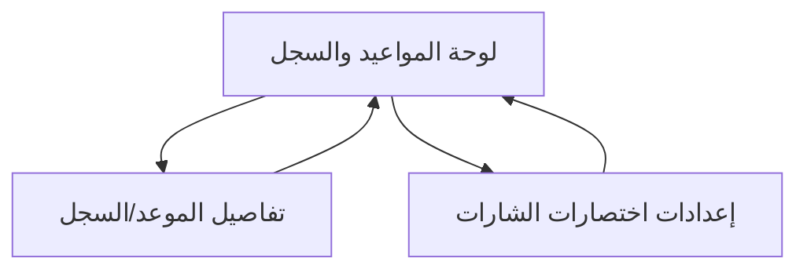

## 1. Product Overview
تحسين تجربة استخدام الشارات عبر تعديل اختصاراتها، وإضافة مساري «المهلة» و«القوة الجبرية» مع حفظهما ضمن المواعيد/السجل.
كما سيتم إخفاء الحاويات الافتراضية وعدم إظهارها إلا عبر زر اختصار لتقليل التشويش على الشاشة.

## 2. Core Features

### 2.1 User Roles
| Role | Registration Method | Core Permissions |
|------|---------------------|------------------|
| مستخدم | تسجيل الدخول بالحساب الحالي للتطبيق | إدارة المواعيد، إضافة مسارات/شارات، تعديل اختصارات الشارات، عرض السجل |

### 2.2 Feature Module
تتكون المتطلبات من الصفحات الأساسية التالية:
1. **لوحة المواعيد والسجل**: قائمة المواعيد، السجل الزمني، شريط اختصارات الشارات، زر إظهار/إخفاء الحاويات.
2. **تفاصيل الموعد/السجل**: عرض تفاصيل عنصر (موعد أو سجل) وتاريخه، إضافة/تعديل المسار «المهلة» و«القوة الجبرية»، تطبيق شارة عبر اختصار.
3. **إعدادات اختصارات الشارات**: تعريف/تعديل اختصارات الشارات، ترتيبها، تمكين/تعطيل الاختصارات.

### 2.3 Page Details
| Page Name | Module Name | Feature description |
|-----------|-------------|---------------------|
| لوحة المواعيد والسجل | قائمة المواعيد | عرض المواعيد بترتيب زمني مع حالات/شارات مختصرة لكل موعد.
| لوحة المواعيد والسجل | السجل (History) | عرض أحداث السجل المرتبطة بالمواعيد (إضافة/تعديل مسار/تغيير شارة) مع وقت الحدث.
| لوحة المواعيد والسجل | شريط اختصارات الشارات | تطبيق شارة على الموعد/العنصر المحدد بنقرة واحدة وفق الاختصارات المعرفة.
| لوحة المواعيد والسجل | زر اختصار الحاويات | إظهار/إخفاء الحاويات (الأقسام/اللوحات الثانوية) افتراضياً تكون مخفية ولا تظهر إلا بالزر.
| تفاصيل الموعد/السجل | معلومات أساسية | عرض بيانات الموعد/العنصر (العنوان، التاريخ/الوقت، الحالة الحالية، آخر تحديث).
| تفاصيل الموعد/السجل | مسار «المهلة» | تعيين/تعديل قيمة «المهلة» للموعد (تشغيل/إيقاف أو تحديد مدة/سبب بحسب نموذج البيانات الحالي) وحفظها.
| تفاصيل الموعد/السجل | مسار «القوة الجبرية» | تعيين/تعديل قيمة «القوة الجبرية» للموعد وحفظها.
| تفاصيل الموعد/السجل | تسجيل الحدث في السجل | إنشاء سجل تلقائي عند إضافة/تعديل «المهلة» أو «القوة الجبرية» أو تغيير الشارة، مع ربطه بالموعد.
| تفاصيل الموعد/السجل | تطبيق شارة عبر اختصار | تطبيق شارة من الاختصارات (مع تأكيد بصري سريع) وتسجيلها في السجل.
| إعدادات اختصارات الشارات | إدارة الاختصارات | إضافة/تعديل/حذف اختصار شارة (اسم، لون/أيقونة إن وجدت، مفتاح/زر الاختصار في الواجهة).
| إعدادات اختصارات الشارات | ترتيب الاختصارات | إعادة ترتيب اختصارات الشارات لعرضها بالشريط حسب الأولوية.
| إعدادات اختصارات الشارات | التفعيل والتحقق | تمكين/تعطيل اختصار، ومنع التعارض (اختصار مكرر) وإظهار رسالة خطأ واضحة.

## 3. Core Process
**تدفق المستخدم (إدارة الشارات والمسارات):**
1) تفتح لوحة المواعيد والسجل وتختار موعداً من القائمة.
2) تستخدم شريط اختصارات الشارات لتطبيق شارة بسرعة على الموعد المحدد.
3) عند الحاجة، تضغط زر اختصار الحاويات لإظهار الأقسام الثانوية (مثل لوحة خيارات/عناصر إضافية)، وتُخفيها عند الانتهاء.
4) تفتح تفاصيل الموعد لتعديل «المهلة» و/أو «القوة الجبرية»، ثم تحفظ.
5) يتم تسجيل كل تغيير تلقائياً ضمن السجل وربطه بالموعد.
6) إذا رغبت بتغيير الاختصارات، تنتقل إلى إعدادات اختصارات الشارات، ثم تعود للوحة.

