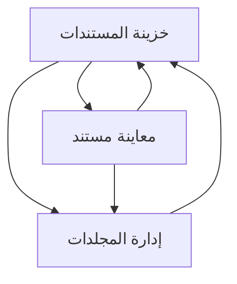

## 1. Product Overview
تطوير «خزينة المستندات» إلى أرشفة ذكية تعتمد على المجلدات، الفرز/الفلترة، ورفع الملفات أو الالتقاط بالكاميرا مع تحويل الصورة إلى PDF.
الهدف: تسهيل حفظ المستندات وتنظيمها والوصول إليها بسرعة مع إجراءات أساسية لكل مستند.

## 2. Core Features

### 2.1 Feature Module
متطلبات خزينة المستندات تتكون من الصفحات الأساسية التالية:
1. **خزينة المستندات**: شجرة/قائمة مجلدات، قائمة مستندات، فرز وفلترة، رفع/كاميرا، إجراءات سريعة لكل مستند.
2. **معاينة مستند**: عارض PDF/صورة، معلومات المستند، إجراءات (إعادة تسمية/نقل).
3. **إدارة المجلدات**: إنشاء/إعادة تسمية/حذف مجلد، تنظيم المجلدات، اختيار وجهة عند نقل المستند.

### 2.2 Page Details
| Page Name | Module Name | Feature description |
|-----------|-------------|---------------------|
| خزينة المستندات | شجرة/قائمة المجلدات | عرض المجلدات وتحديد المجلد الحالي لعرض محتواه. |
| خزينة المستندات | قائمة المستندات | عرض المستندات داخل المجلد المحدد مع بيانات مختصرة (اسم، تاريخ، نوع). |
| خزينة المستندات | فرز/فلترة | فرز حسب (الأحدث/الأقدم/الاسم) وفلترة حسب (النوع: PDF/صورة) ضمن المجلد الحالي. |
| خزينة المستندات | رفع/كاميرا + تحويل إلى PDF | رفع ملف من الجهاز أو التقاط صورة بالكاميرا؛ عند اختيار صورة يتم تحويلها إلى PDF قبل الحفظ؛ إظهار حالة التقدم والأخطاء. |
| خزينة المستندات | إجراءات المستند (سريع) | تنفيذ (معاينة/إعادة تسمية/نقل) من قائمة إجراءات لكل مستند دون مغادرة الصفحة عند الإمكان. |
| معاينة مستند | عارض المستند | عرض PDF (صفحات/تكبير/تصغير) أو عرض صورة إذا لم تتوفر نسخة PDF. |
| معاينة مستند | معلومات وإجراءات | عرض اسم المستند ومجلده وتاريخه؛ تنفيذ (إعادة تسمية/نقل) مع تأكيد نجاح العملية. |
| إدارة المجلدات | إدارة المجلدات | إنشاء مجلد جديد، إعادة تسمية مجلد، حذف مجلد (مع منع الحذف إذا كان غير فارغ أو طلب نقل المحتوى أولاً). |
| إدارة المجلدات | نقل المستند | اختيار مجلد وجهة عند نقل مستند (قائمة مجلدات قابلة للبحث إن لزم). |

## 3. Core Process
**تدفق المستخدم (عام):**
1) تفتح خزينة المستندات وتختار مجلدًا من قائمة المجلدات.
2) تطبق فرز/فلترة لتقليل النتائج داخل المجلد.
3) تضيف مستندًا إمّا برفع ملف أو التقاط صورة بالكاميرا.
4) إذا كان الإدخال صورة: يتم تحويلها إلى PDF ثم حفظها وإضافتها لقائمة المستندات.
5) تفتح المعاينة لقراءة المستند.
6) من الإجراءات: تعيد تسمية المستند أو تنقله إلى مجلد آخر.

