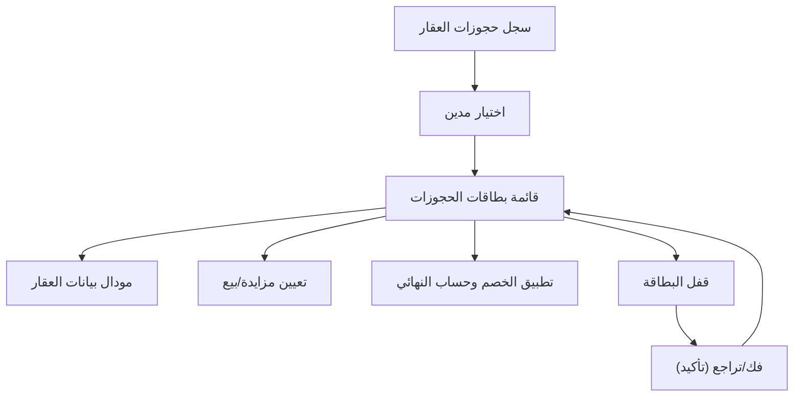

## 1. Product Overview
تمكين دورة حياة «حجز العقار» بعد موافقة المنفّذ عبر سجل حجوزات بطاقات واضح وقابل للتدقيق.
يركّز على عرض بيانات العقار، إدارة المزاد/البيع، تطبيق الخصم، وإتاحة فك/تراجع مع قفل البطاقة.

## 2. Core Features

### 2.1 User Roles
| Role | Registration Method | Core Permissions |
|------|---------------------|------------------|
| المنفّذ | حساب داخلي مُسبق الإنشاء | اعتماد الحجز، قفل/فتح البطاقة، تنفيذ فك/تراجع، تعديل منطق الخصم وحالة المزاد/البيع |
| مستخدم عرض (مراقب) | حساب داخلي مُسبق الإنشاء | تصفح سجل الحجوزات، فتح مودال بيانات العقار، مشاهدة تاريخ العمليات |

### 2.2 Feature Module
متطلبات حجز العقار تتكون من الصفحة الأساسية التالية:
1. **سجل حجوزات العقار (بعد موافقة المنفّذ)**: قائمة مدينين + شارة تحت المدين، سجل حجوزات ببطاقات، مودال بيانات عقار، حالات مزايدة/بيع، منطق خصم، إجراءات فك/تراجع مع قفل البطاقة.

### 2.3 Page Details
| Page Name | Module Name | Feature description |
|-----------|-------------|---------------------|
| سجل حجوزات العقار (بعد موافقة المنفّذ) | قائمة المدينين + الشارة | عرض المدينين وتمييز حالة/مؤشر أساسي عبر «شارة تحت اسم المدين» لبيان أن لديه حجز عقار مُعتمد/قيد الإجراء. |
| سجل حجوزات العقار (بعد موافقة المنفّذ) | بطاقات الحجوزات | عرض الحجوزات كبطاقات تتضمن: بيانات موجزة للعقار، الحالة (مزايدة/بيع)، مبالغ قبل/بعد الخصم، وحالة القفل (مقفلة/غير مقفلة). |
| سجل حجوزات العقار (بعد موافقة المنفّذ) | مودال بيانات العقار | فتح مودال يعرض بيانات العقار الأساسية المرتبطة بالبطاقة (رقم/وصف/موقع مختصر/ملكية/قيود إن وجدت ضمن البيانات المتاحة). |
| سجل حجوزات العقار (بعد موافقة المنفّذ) | منطق المزاد/البيع | تعيين نمط التصرف (مزايدة أو بيع) لكل بطاقة، وتحديث الحالة التشغيلية (مثلاً: نشط/مكتمل/ملغي) وفق صلاحيات المنفّذ. |
| سجل حجوزات العقار (بعد موافقة المنفّذ) | منطق الخصم | إدخال/تعديل قيمة الخصم (نسبة أو مبلغ) وحساب «المبلغ النهائي» وعرض أثر الخصم داخل البطاقة بشكل فوري وواضح. |
| سجل حجوزات العقار (بعد موافقة المنفّذ) | فك/تراجع + قفل البطاقة | تنفيذ فك/تراجع للحجز عبر إجراء مؤكد، ثم قفل البطاقة لمنع التعديل، مع إمكانية فتح القفل فقط لمن لديه صلاحية المنفّذ. |
| سجل حجوزات العقار (بعد موافقة المنفّذ) | سجل العمليات على البطاقة | تسجيل وعرض أحداث البطاقة (اعتماد، تغيير مزايدة/بيع، تطبيق خصم، قفل/فتح، فك/تراجع) مع الوقت والفاعل. |

## 3. Core Process
**تدفق المنفّذ:**
1) يفتح سجل حجوزات العقار ويختار المدين من القائمة (مع ملاحظة الشارة أسفل الاسم عند وجود حجز/حالة مهمة).
2) يراجع البطاقات، ويفتح «مودال بيانات العقار» عند الحاجة للتأكد من التفاصيل.
3) يحدد نمط المعالجة على البطاقة: مزايدة أو بيع، ويحدّث الحالة التشغيلية.
4) يطبق منطق الخصم (نسبة/مبلغ) ويعتمد الحساب النهائي المعروض.
5) بعد تثبيت القرار، يقفل البطاقة لمنع التعديلات اللاحقة.
6) عند الضرورة، ينفّذ «فك/تراجع» عبر تأكيد صريح؛ تُسجّل العملية ويُطبّق القفل/التجميد على البطاقة حسب السياسة.

**تدفق مستخدم العرض (مراقب):**
1) يتصفح المدينين والبطاقات.
2) يفتح مودال بيانات العقار ويطّلع على سجل العمليات دون إجراء تعديلات.

