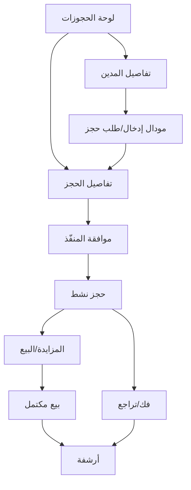

## 1. Product Overview
نظام لإدارة دورة حياة «حجز مال منقول» بعد موافقة المنفّذ، من إنشاء طلب الحجز حتى المزايدة/البيع ثم فك/تراجع وأرشفة كاملة.
يخدم فرق التنفيذ لتحويل الإجراءات إلى خطوات رقمية واضحة بحالات مالية قابلة للتتبع.

## 2. Core Features

### 2.1 User Roles
| الدور | طريقة التسجيل/الدخول | الصلاحيات الأساسية |
|------|------------------------|--------------------|
| موظف إدخال | حساب داخلي (مُدار مؤسسيًا) | إنشاء طلب حجز، إدخال بيانات المال المنقول، متابعة الحالة للقراءة |
| المنفّذ | حساب داخلي (مُدار مؤسسيًا) | الموافقة/الرفض، تفعيل الحجز، تنفيذ فك/تراجع، اعتماد الأرشفة |
| مدقق/مالي | حساب داخلي (مُدار مؤسسيًا) | مراجعة منطق المبالغ، اعتماد قيود/حركات مالية متعلقة بالبيع |

### 2.2 Feature Module
متطلبات النظام تتكون من الصفحات الرئيسية التالية:
1. **لوحة الحجوزات**: بحث/تصفية، سجل حجوزات ببطاقات، انتقال لتفاصيل المدين/الحجز.
2. **تفاصيل المدين**: شارة حالة الحجز تحت المدين، قائمة الحجوزات ببطاقات، مودال إدخال/طلب حجز مال منقول.
3. **تفاصيل الحجز**: حالة الحجز (مسودة/بانتظار موافقة/موافق عليه/نشط/بيع/منتهي/مفكوك/متراجع/مؤرشف)، سجل أحداث، إجراءات (موافقة، فك، تراجع، أرشفة).
4. **المزايدة/البيع**: إدارة المزاد/البيع، استقبال عروض/تسجيل بيع، منطق مالي (توزيع/رسوم/صافي)، تثبيت النتائج وإرجاعها للحجز.

### 2.3 Page Details
| Page Name | Module Name | Feature description |
|-----------|-------------|---------------------|
| لوحة الحجوزات | بحث وتصفية | عرض قائمة بطاقات الحجوزات مع فلترة بالحالة، رقم المدين/القضية، تاريخ الإنشاء، آخر تحديث. |
| لوحة الحجوزات | بطاقات السجل | إظهار بطاقة لكل حجز تتضمن: المدين، المال المنقول، حالة الموافقة، حالة التنفيذ، ملخص مالي (إن وجد)، زر فتح التفاصيل. |
| لوحة الحجوزات | تنقّل | الانتقال إلى تفاصيل المدين أو تفاصيل الحجز من البطاقة. |
| تفاصيل المدين | شارة تحت المدين | عرض شارة/شارات حالة مرتبطة بالحجوزات (مثلاً: «بانتظار موافقة المنفّذ»، «حجز نشط»، «بيع قيد المعالجة»). |
| تفاصيل المدين | سجل الحجوزات ببطاقات | عرض جميع حجوزات المدين كبطاقات: حالة، مال منقول، تاريخ، إجراءات سريعة للعرض. |
| تفاصيل المدين | مودال إدخال/طلب حجز | فتح مودال لإدخال بيانات الحجز والمال المنقول: وصف مختصر، قيمة تقديرية، مرفقات/مستندات (اختياري)، ملاحظات، ثم حفظ كـ«بانتظار موافقة المنفّذ». |
| تفاصيل الحجز | حالة وسجل أحداث | عرض خط زمني/سجل أحداث للحجز: إنشاء، تعديل، إرسال للموافقة، قرار المنفّذ، بدء تنفيذ، انتقال للمزايدة/البيع، تثبيت مالي، فك/تراجع، أرشفة. |
| تفاصيل الحجز | موافقة المنفّذ | تمكين المنفّذ من: الموافقة أو الرفض مع سبب، وتغيير الحالة وفق القرار. |
| تفاصيل الحجز | إجراءات فك/تراجع | تنفيذ «فك الحجز» أو «تراجع» مع سبب وإرفاق مستند (اختياري)، مع قفل التعديل على الخطوات السابقة وإضافة حدث. |
| تفاصيل الحجز | أرشفة | نقل الحجز إلى «مؤرشف» بعد الإنهاء (بيع مكتمل أو فك/تراجع) مع حفظ لقطة بيانات الحالة النهائية. |
| المزايدة/البيع | إعداد المزاد/البيع | إنشاء عملية بيع مرتبطة بالحجز: نوع (مزايدة/بيع مباشر)، تواريخ أساسية، سعر أساس/حد أدنى (إن وجد). |
| المزايدة/البيع | عروض/تسجيل بيع | تسجيل عروض (المزايدة) أو إدخال عملية بيع نهائية (بيع مباشر) مع المشتري/القيمة ومرجع العملية. |
| المزايدة/البيع | منطق مالي | احتساب ملخص مالي: المبلغ الإجمالي، الرسوم/العمولات/المصاريف، الصافي، وتوزيع مبالغ (إن لزم) مع التحقق من المجاميع ومنع الاعتماد إذا كانت القيم غير متوازنة. |
| المزايدة/البيع | تثبيت وإرجاع للحجز | اعتماد النتائج وإقفالها ثم تحديث حالة الحجز إلى «بيع مكتمل» مع إظهار الملخص المالي في بطاقة الحجز. |

## 3. Core Process
**تدفق موظف الإدخال**: تفتح لوحة الحجوزات وتنتقل لمدين محدد، ثم من تفاصيل المدين تفتح مودال إدخال الحجز وتُدخل بيانات المال المنقول وتُرسل الطلب ليصبح «بانتظار موافقة المنفّذ»، ثم تتابع حالة الحجز وسجل الأحداث.

**تدفق المنفّذ**: يفتح تفاصيل الحجز «بانتظار موافقة»، يراجع البيانات ويُوافق (ليصبح الحجز «موافق عليه/نشط») أو يرفض مع سبب. بعد ذلك يمكنه تحويل الحجز إلى مرحلة المزايدة/البيع، أو تنفيذ «فك/تراجع» عند الحاجة، ثم أرشفة الحجز عند اكتمال الإجراء.

**تدفق المالي/المدقق**: يفتح صفحة المزايدة/البيع للحجز، يراجع المدخلات ويعتمد منطق التوزيع/الرسوم والصافي، ثم يثبت النتائج لتنعكس على الحجز.

