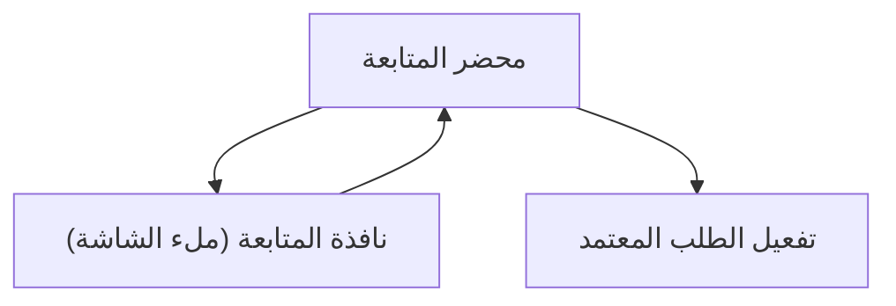

## 1. Product Overview
إعادة تنظيم واجهة “محضر المتابعة” لتحسين الوضوح وتقليل التبويبات غير اللازمة.
يشمل ذلك حذف تبويب “الصرف/Disburse”، إصلاح تفعيل “الطلب المعتمد”، وإعادة تصميم نافذة المتابعة لتصبح ملء الشاشة مع تبويبات عمودية RTL.

## 2. Core Features

### 2.1 Feature Module
متطلبات “محضر المتابعة” تتكون من الصفحات/الشاشات الأساسية التالية:
1. **محضر المتابعة**: تبويبات المحضر (بدون الصرف)، شريط أزرار الإجراءات بعد نقلها، قسم الطلبات/الاعتمادات وتفعيل الطلب المعتمد.
2. **نافذة المتابعة (ملء الشاشة)**: تبويبات عمودية RTL، نموذج إدخال/تعديل بيانات المتابعة، أزرار حفظ/إغلاق بمواقع واضحة.

### 2.3 Page Details
| Page Name | Module Name | Feature description |
|-----------|-------------|---------------------|
| محضر المتابعة | إدارة التبويبات | عرض تبويبات المحضر الحالية مع حذف تبويب “الصرف/Disburse” نهائياً (لا يظهر ولا يمكن الوصول له). |
| محضر المتابعة | شريط الإجراءات | نقل أزرار الإجراءات الحالية من مواقعها السابقة إلى شريط إجراءات موحد (واضح وثابت داخل صفحة المحضر) مع الحفاظ على نفس السلوكيات الحالية للأزرار. |
| محضر المتابعة | تفعيل الطلب المعتمد | تمكين/تفعيل إجراء “تفعيل الطلب” عندما تكون حالة الطلب “معتمد/Approved” (بدون الحاجة لخطوات إضافية غير لازمة)، وإظهار حالة التعطيل مع سبب واضح عندما لا يكون الطلب معتمداً. |
| نافذة المتابعة (ملء الشاشة) | إطار النافذة | فتح النافذة بوضع ملء الشاشة فوق الصفحة (Overlay) مع عنوان واضح وزر إغلاق. |
| نافذة المتابعة (ملء الشاشة) | تبويبات عمودية RTL | عرض تبويبات المتابعة بشكل عمودي على جهة اليمين (RTL) مع حالة نشطة واضحة وإمكانية التنقل عبر النقر/لوحة المفاتيح. |
| نافذة المتابعة (ملء الشاشة) | نموذج المتابعة | إدخال/تعديل بيانات المتابعة ضمن محتوى التبويب المختار مع رسائل تحقق مختصرة وأزرار “حفظ/إلغاء” (أو ما يعادلها حالياً) ضمن النافذة. |

## 3. Core Process
**تدفق المستخدم (عام):**
- تفتح شاشة “محضر المتابعة” وتعرض التبويبات بعد إزالة “الصرف”.
- يستخدم المستخدم شريط الإجراءات الجديد لتنفيذ نفس الأوامر الحالية (مثل إضافة/تعديل/حفظ حسب المتوفر).
- عند وجود “طلب” بحالة “معتمد”، يصبح إجراء “تفعيل الطلب” متاحاً ويمكن تنفيذه.
- عند إضافة/تعديل متابعة، تُفتح “نافذة المتابعة (ملء الشاشة)” وتُستخدم التبويبات العمودية RTL للتنقل، ثم حفظ أو إغلاق.

