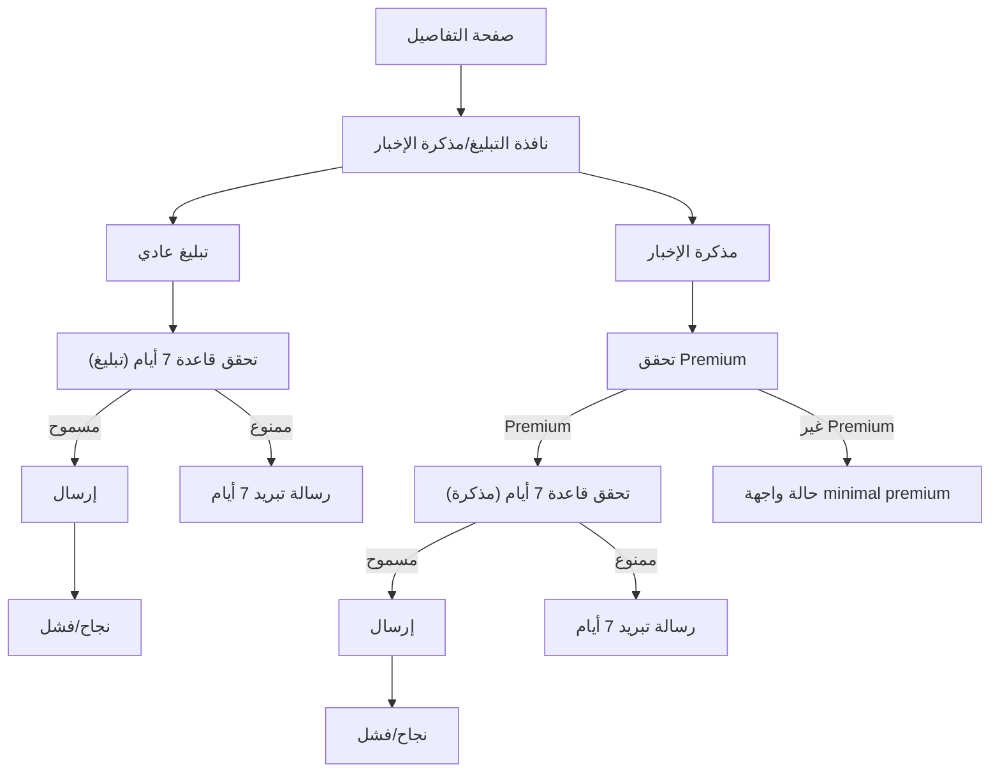

## 1. Product Overview
إعادة هيكلة نافذة «التبليغ/مذكرة الإخبار» لتصبح أوضح وأقل أخطاء عبر فصل الـstate بين المسارين.
يشمل ذلك تطبيق قاعدة منع الإرسال المتكرر خلال 7 أيام، وتحديد حالات واجهة minimal لتمييز Premium.

## 2. Core Features

### 2.1 User Roles
| الدور | طريقة التسجيل | الصلاحيات الأساسية |
|------|----------------|--------------------|
| مستخدم (عادي/مسجّل) | حسب نظام الدخول الحالي | يستطيع إرسال «تبليغ عادي» مع تطبيق قاعدة 7 أيام |
| مستخدم Premium | ترقية ضمن النظام الحالي | يستطيع إرسال «تبليغ عادي» و«مذكرة الإخبار» مع تطبيق قاعدة 7 أيام لكل نوع |

### 2.2 Feature Module
متطلباتنا تتكون من الصفحات/الشاشات التالية:
1. **صفحة التفاصيل (حيث يظهر زر التبليغ)**: زر فتح النافذة، تمرير معرف الهدف (Target) للنافذة.
2. **نافذة «التبليغ/مذكرة الإخبار»**: تبديل النوع، نموذج إدخال، قاعدة 7 أيام، حالات Premium، إرسال وعرض النتيجة.

### 2.3 Page Details
| Page Name | Module Name | Feature description |
|-----------|-------------|---------------------|
| صفحة التفاصيل | فتح النافذة | فتح نافذة «التبليغ/مذكرة الإخبار» وتمرير بيانات الهدف (مثل id/عنوان مختصر) لعرضها داخل النافذة. |
| نافذة «التبليغ/مذكرة الإخبار» | اختيار النوع | اختيار «تبليغ عادي» أو «مذكرة الإخبار» مع الحفاظ على state مستقل لكل نوع (حقول/أخطاء/حالة إرسال/نتيجة). |
| نافذة «التبليغ/مذكرة الإخبار» | نموذج «التبليغ العادي» | إدخال سبب/وصف مختصر (وما يلزم من حقول حالياً) ثم التحقق من الصحة وإرسال الطلب. |
| نافذة «التبليغ/مذكرة الإخبار» | نموذج «مذكرة الإخبار» | عرض النموذج كاملاً فقط لمستخدم Premium؛ وإلا عرض حالة minimal (قفل + رسالة) بدون السماح بالإرسال. |
| نافذة «التبليغ/مذكرة الإخبار» | قاعدة 7 أيام (لكل نوع) | منع الإرسال إذا وُجد إرسال سابق لنفس (المستخدم + الهدف + النوع) خلال آخر 7 أيام، مع عرض رسالة واضحة ووقت متبقٍ تقديري. |
| نافذة «التبليغ/مذكرة الإخبار» | حالات الإرسال/النتيجة | عرض حالات: جاهز، جارٍ الإرسال، نجاح، فشل (مع إعادة المحاولة) لكل نوع بشكل مستقل. |

## 3. Core Process
**تدفق المستخدم (تبليغ عادي):** من صفحة التفاصيل تفتح النافذة على وضع «تبليغ عادي»، يملأ المستخدم الحقول، إذا كانت قاعدة 7 أيام غير مفعّلة يتم الإرسال، ثم تظهر نتيجة النجاح/الفشل.

**تدفق المستخدم Premium (مذكرة الإخبار):** يبدّل إلى «مذكرة الإخبار»، إذا كان Premium ويُسمح حسب قاعدة 7 أيام يتم الإرسال؛ إذا لم يكن Premium تظهر حالة minimal (قفل + توضيح أنها Premium) بدون إرسال.

