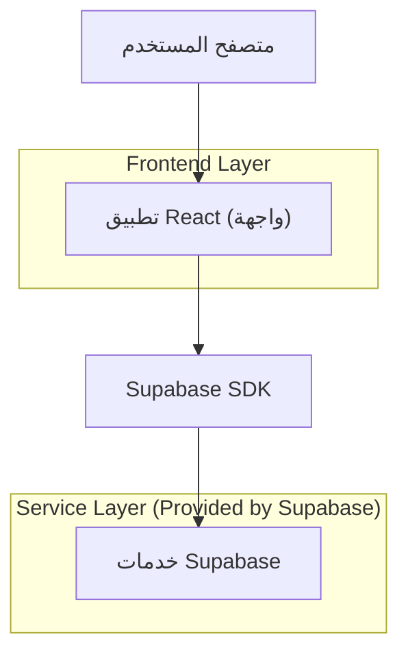
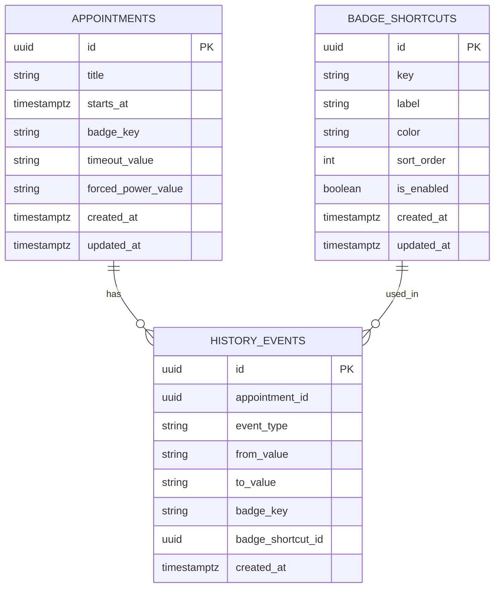

## 1.Architecture design


## 2.Technology Description
- Frontend: React@18 + vite + tailwindcss@3
- Backend: Supabase (Auth + PostgreSQL)

## 3.Route definitions
| Route | Purpose |
|-------|---------|
| / | لوحة المواعيد والسجل + شريط اختصارات الشارات + زر إظهار/إخفاء الحاويات |
| /items/:id | تفاصيل الموعد/السجل لإدارة «المهلة» و«القوة الجبرية» وتطبيق الشارات |
| /settings/badges | إعدادات اختصارات الشارات (إضافة/تعديل/ترتيب/تفعيل) |

## 6.Data model(if applicable)

### 6.1 Data model definition


### 6.2 Data Definition Language
Appointments (appointments)
```
CREATE TABLE appointments (
  id UUID PRIMARY KEY DEFAULT gen_random_uuid(),
  title TEXT NOT NULL,
  starts_at TIMESTAMPTZ,
  badge_key TEXT,
  timeout_value TEXT,
  forced_power_value TEXT,
  created_at TIMESTAMPTZ DEFAULT NOW(),
  updated_at TIMESTAMPTZ DEFAULT NOW()
);

-- basic access
GRANT SELECT ON appointments TO anon;
GRANT ALL PRIVILEGES ON appointments TO authenticated;
```

History Events (history_events)
```
CREATE TABLE history_events (
  id UUID PRIMARY KEY DEFAULT gen_random_uuid(),
  appointment_id UUID NOT NULL,
  event_type TEXT NOT NULL,
  from_value TEXT,
  to_value TEXT,
  badge_key TEXT,
  badge_shortcut_id UUID,
  created_at TIMESTAMPTZ DEFAULT NOW()
);

CREATE INDEX idx_history_events_appointment_id ON history_events(appointment_id);
CREATE INDEX idx_history_events_created_at ON history_events(created_at DESC);

GRANT SELECT ON history_events TO anon;
GRANT ALL PRIVILEGES ON history_events TO authenticated;
```

Badge Shortcuts (badge_shortcuts)
```
CREATE TABLE badge_shortcuts (
  id UUID PRIMARY KEY DEFAULT gen_random_uuid(),
  key TEXT UNIQUE NOT NULL,
  label TEXT NOT NULL,
  color TEXT,
  sort_order INT DEFAULT 0,
  is_enabled BOOLEAN DEFAULT TRUE,
  created_at TIMESTAMPTZ DEFAULT NOW(),
  updated_at TIMESTAMPTZ DEFAULT NOW()
);

CREATE INDEX idx_badge_shortcuts_sort_order ON badge_shortcuts(sort_order);

GRANT SELECT ON badge_shortcuts TO anon;
GRANT ALL PRIVILEGES ON badge_shortcuts TO authenticated;
```

ملاحظات تنفيذية مختصرة:
- يتم حفظ «المهلة» و«القوة الجبرية» كقيم نصية (TEXT) لتجنب فرض نموذج محدد قبل وضوح المتطلبات الدقيقة؛ يمكن ترقيتها لاحقاً إلى نوع منظم (JSONB/ENUM) عند الحاجة.
- عند أي تغيير في badge_key أو timeout_value أو forced_power_value: يُنشأ سجل جديد في history_events يوضح event_type والقيم قبل/بعد.
- إخفاء الحاويات: حالة واجهة (UI state) محلية في React مع زر واحد يُظهرها عند الطلب (ولا تحتاج تخزيناً بالضرورة).
