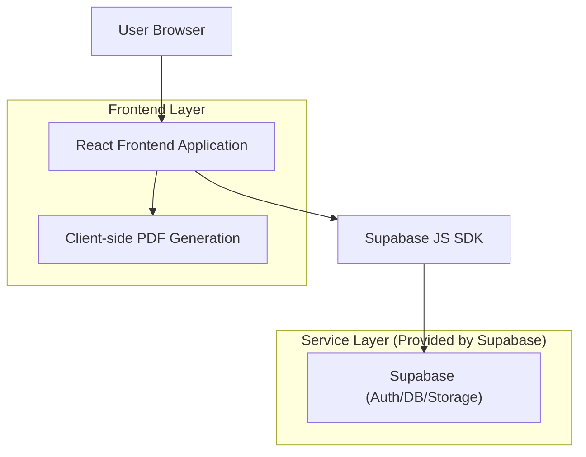

## 1.Architecture design


## 2.Technology Description
- Frontend: React@18 + TypeScript + (نفس نظام الواجهة الحالي: ألوان/مكونات) + pdf-lib (أو بديل مكافئ) لتحويل الصور إلى PDF + مكتبة عرض PDF (حسب الموجود)
- Backend: Supabase (PostgreSQL + Storage + Auth إن كانت الخزينة مرتبطة بحساب المستخدم)

## 3.Route definitions
| Route | Purpose |
|-------|---------|
| /documents | صفحة خزينة المستندات: مجلدات، قائمة مستندات، رفع/كاميرا، فرز/فلترة، إجراءات سريعة | 
| /documents/:id | صفحة معاينة مستند: عارض المستند + إجراءات (إعادة تسمية/نقل) |
| /folders | صفحة إدارة المجلدات: إنشاء/إعادة تسمية/حذف + اختيار وجهة النقل |

## 6.Data model(if applicable)

### 6.1 Data model definition
- folders: تعريف المجلدات (مع دعم تدرج اختياري عبر parent_id)
- documents: تعريف المستندات وربطها منطقيًا بمجلد عبر folder_id (بدون قيود FK مادية)

### 6.2 Data Definition Language
Folders Table (folders)
```
CREATE TABLE folders (
  id UUID PRIMARY KEY DEFAULT gen_random_uuid(),
  name TEXT NOT NULL,
  parent_id UUID NULL,
  sort_order INTEGER DEFAULT 0,
  created_at TIMESTAMP WITH TIME ZONE DEFAULT NOW(),
  updated_at TIMESTAMP WITH TIME ZONE DEFAULT NOW()
);

CREATE INDEX idx_folders_parent_id ON folders(parent_id);
CREATE INDEX idx_folders_sort_order ON folders(sort_order);
```

Documents Table (documents)
```
CREATE TABLE documents (
  id UUID PRIMARY KEY DEFAULT gen_random_uuid(),
  folder_id UUID NULL,
  title TEXT NOT NULL,
  storage_path TEXT NOT NULL,
  mime_type TEXT NOT NULL,
  source TEXT NOT NULL CHECK (source IN ('upload','camera')),
  page_count INTEGER NULL,
  created_at TIMESTAMP WITH TIME ZONE DEFAULT NOW(),
  updated_at TIMESTAMP WITH TIME ZONE DEFAULT NOW()
);

CREATE INDEX idx_documents_folder_id ON documents(folder_id);
CREATE INDEX idx_documents_created_at ON documents(created_at DESC);
CREATE INDEX idx_documents_title ON documents(title);
```

Access notes (Supabase)
- يوصى بتفعيل RLS وربط السجلات بالمستخدم (إن كانت الخزينة خاصة لكل حساب).
- أمثلة صلاحيات عامة (عدّلها حسب سياسة الخصوصية المطلوبة):
```
GRANT SELECT ON folders TO anon;
GRANT ALL PRIVILEGES ON folders TO authenticated;

GRANT SELECT ON documents TO anon;
GRANT ALL PRIVILEGES ON documents TO authenticated;
```
