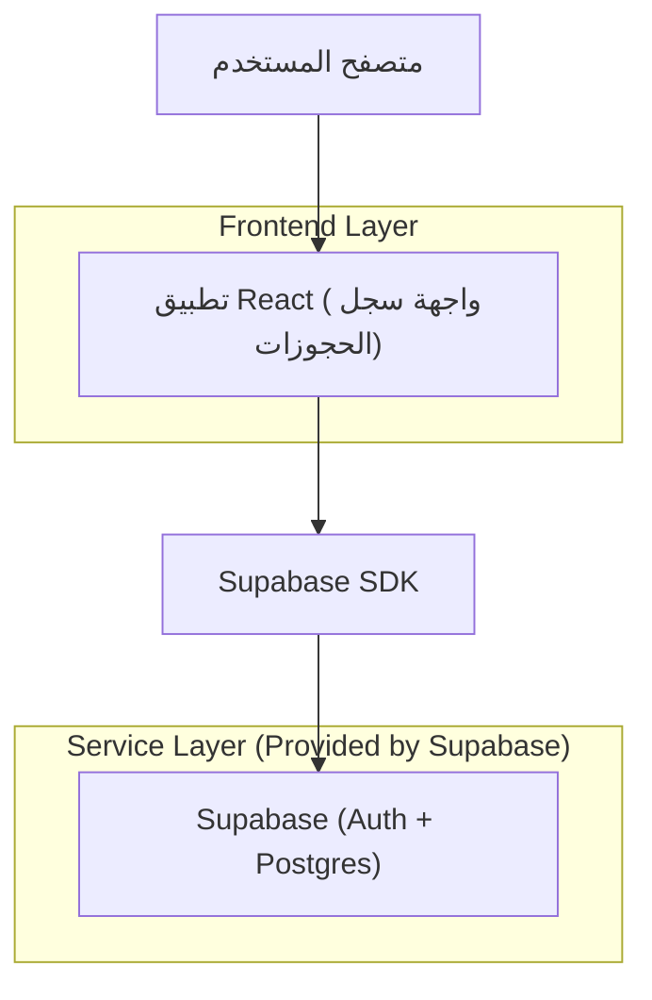
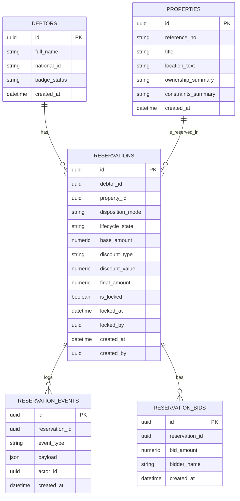

## 1.Architecture design


## 2.Technology Description
- Frontend: React@18 + TypeScript + vite + tailwindcss@3
- Backend: Supabase (Auth + PostgreSQL)

## 3.Route definitions
| Route | Purpose |
|-------|---------|
| /reservations | صفحة سجل حجوزات العقار: قائمة المدينين، بطاقات الحجوزات، المودالات والإجراءات |
| /reservations/:debtorId | (اختياري) فتح السجل مع تثبيت مدين محدد لروابط داخلية |

## 6.Data model(if applicable)

### 6.1 Data model definition


### 6.2 Data Definition Language
> ملاحظة: لتبسيط النشر المبكر، تُستخدم مفاتيح أجنبية منطقية (بدون قيود FK فعلية).

Debtors Table (debtors)
```sql
CREATE TABLE debtors (
  id UUID PRIMARY KEY DEFAULT gen_random_uuid(),
  full_name VARCHAR(200) NOT NULL,
  national_id VARCHAR(50),
  badge_status VARCHAR(30) DEFAULT 'none',
  created_at TIMESTAMPTZ DEFAULT NOW()
);

CREATE INDEX idx_debtors_full_name ON debtors(full_name);
```

Properties Table (properties)
```sql
CREATE TABLE properties (
  id UUID PRIMARY KEY DEFAULT gen_random_uuid(),
  reference_no VARCHAR(80) UNIQUE,
  title VARCHAR(200) NOT NULL,
  location_text VARCHAR(300),
  ownership_summary TEXT,
  constraints_summary TEXT,
  created_at TIMESTAMPTZ DEFAULT NOW()
);

CREATE INDEX idx_properties_reference_no ON properties(reference_no);
```

Reservations Table (reservations)
```sql
CREATE TABLE reservations (
  id UUID PRIMARY KEY DEFAULT gen_random_uuid(),
  debtor_id UUID NOT NULL,
  property_id UUID NOT NULL,
  disposition_mode VARCHAR(20) NOT NULL CHECK (disposition_mode IN ('auction','sale')),
  lifecycle_state VARCHAR(30) NOT NULL CHECK (lifecycle_state IN ('draft','executor_approved','locked','reverted')),
  base_amount NUMERIC(14,2) DEFAULT 0,
  discount_type VARCHAR(10) CHECK (discount_type IN ('percent','amount')),
  discount_value NUMERIC(14,2) DEFAULT 0,
  final_amount NUMERIC(14,2) DEFAULT 0,
  is_locked BOOLEAN DEFAULT FALSE,
  locked_at TIMESTAMPTZ,
  locked_by UUID,
  created_at TIMESTAMPTZ DEFAULT NOW(),
  created_by UUID
);

CREATE INDEX idx_reservations_debtor_id ON reservations(debtor_id);
CREATE INDEX idx_reservations_property_id ON reservations(property_id);
CREATE INDEX idx_reservations_state ON reservations(lifecycle_state);
```

Reservation Bids Table (reservation_bids)
```sql
CREATE TABLE reservation_bids (
  id UUID PRIMARY KEY DEFAULT gen_random_uuid(),
  reservation_id UUID NOT NULL,
  bid_amount NUMERIC(14,2) NOT NULL,
  bidder_name VARCHAR(200),
  created_at TIMESTAMPTZ DEFAULT NOW()
);

CREATE INDEX idx_bids_reservation_id ON reservation_bids(reservation_id);
```

Reservation Events Table (reservation_events)
```sql
CREATE TABLE reservation_events (
  id UUID PRIMARY KEY DEFAULT gen_random_uuid(),
  reservation_id UUID NOT NULL,
  event_type VARCHAR(50) NOT NULL,
  payload JSONB DEFAULT '{}'::jsonb,
  actor_id UUID,
  created_at TIMESTAMPTZ DEFAULT NOW()
);

CREATE INDEX idx_events_reservation_id ON reservation_events(reservation_id);
CREATE INDEX idx_events_created_at ON reservation_events(created_at DESC);
```

Permissions (baseline)
```sql
GRANT SELECT ON debtors TO anon;
GRANT SELECT ON properties TO anon;
GRANT SELECT ON reservations TO anon;
GRANT SELECT ON reservation_bids TO anon;
GRANT SELECT ON reservation_events TO anon;

GRANT ALL PRIVILEGES ON debtors TO authenticated;
GRANT ALL PRIVILEGES ON properties TO authenticated;
GRANT ALL PRIVILEGES ON reservations TO authenticated;
GRANT ALL PRIVILEGES ON reservation_bids TO authenticated;
GRANT ALL PRIVILEGES ON reservation_events TO authenticated;
```
