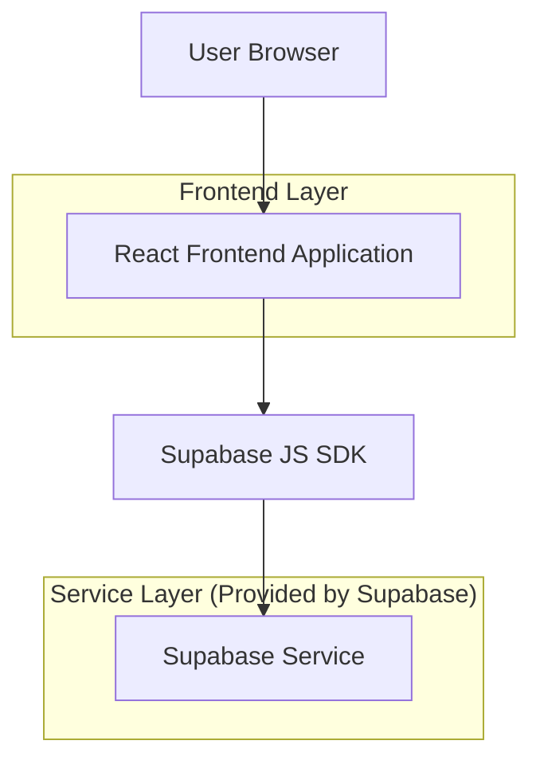
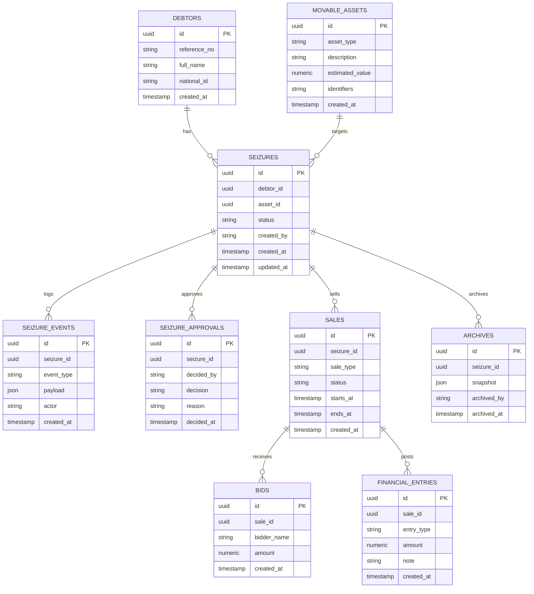

## 1.Architecture design


## 2.Technology Description
- Frontend: React@18 + TypeScript + vite + tailwindcss@3
- Backend: Supabase (PostgreSQL + Auth + Storage)

## 3.Route definitions
| Route | Purpose |
|-------|---------|
| / | لوحة الحجوزات: سجل بطاقات الحجوزات + بحث/تصفية |
| /debtors/:debtorId | تفاصيل المدين: شارة الحالة + بطاقات حجوزات المدين + مودال طلب حجز |
| /seizures/:seizureId | تفاصيل الحجز: حالة، سجل أحداث، موافقة المنفّذ، فك/تراجع، أرشفة |
| /seizures/:seizureId/sale | المزايدة/البيع: عروض/بيع + منطق مالي + تثبيت النتائج |

## 6.Data model(if applicable)

### 6.1 Data model definition


### 6.2 Data Definition Language
Debtors (debtors)
```sql
CREATE TABLE debtors (
  id UUID PRIMARY KEY DEFAULT gen_random_uuid(),
  reference_no TEXT NOT NULL,
  full_name TEXT NOT NULL,
  national_id TEXT,
  created_at TIMESTAMPTZ DEFAULT NOW()
);

GRANT SELECT ON debtors TO anon;
GRANT ALL PRIVILEGES ON debtors TO authenticated;
```

Movable assets (movable_assets)
```sql
CREATE TABLE movable_assets (
  id UUID PRIMARY KEY DEFAULT gen_random_uuid(),
  asset_type TEXT NOT NULL,
  description TEXT NOT NULL,
  estimated_value NUMERIC(14,2),
  identifiers TEXT,
  created_at TIMESTAMPTZ DEFAULT NOW()
);

GRANT SELECT ON movable_assets TO anon;
GRANT ALL PRIVILEGES ON movable_assets TO authenticated;
```

Seizures (seizures)
```sql
CREATE TABLE seizures (
  id UUID PRIMARY KEY DEFAULT gen_random_uuid(),
  debtor_id UUID NOT NULL,
  asset_id UUID NOT NULL,
  status TEXT NOT NULL CHECK (status IN (
    'draft','pending_executor_approval','rejected','approved','active',
    'sale_in_progress','sold','released','rolled_back','archived'
  )),
  created_by TEXT NOT NULL,
  created_at TIMESTAMPTZ DEFAULT NOW(),
  updated_at TIMESTAMPTZ DEFAULT NOW()
);

CREATE INDEX idx_seizures_debtor_id ON seizures(debtor_id);
CREATE INDEX idx_seizures_status ON seizures(status);

GRANT SELECT ON seizures TO anon;
GRANT ALL PRIVILEGES ON seizures TO authenticated;
```

Seizure approvals (seizure_approvals)
```sql
CREATE TABLE seizure_approvals (
  id UUID PRIMARY KEY DEFAULT gen_random_uuid(),
  seizure_id UUID NOT NULL,
  decided_by TEXT NOT NULL,
  decision TEXT NOT NULL CHECK (decision IN ('approved','rejected')),
  reason TEXT,
  decided_at TIMESTAMPTZ DEFAULT NOW()
);

CREATE INDEX idx_seizure_approvals_seizure_id ON seizure_approvals(seizure_id);

GRANT SELECT ON seizure_approvals TO anon;
GRANT ALL PRIVILEGES ON seizure_approvals TO authenticated;
```

Seizure events (seizure_events)
```sql
CREATE TABLE seizure_events (
  id UUID PRIMARY KEY DEFAULT gen_random_uuid(),
  seizure_id UUID NOT NULL,
  event_type TEXT NOT NULL,
  payload JSONB NOT NULL DEFAULT '{}'::jsonb,
  actor TEXT NOT NULL,
  created_at TIMESTAMPTZ DEFAULT NOW()
);

CREATE INDEX idx_seizure_events_seizure_id ON seizure_events(seizure_id);
CREATE INDEX idx_seizure_events_created_at ON seizure_events(created_at DESC);

GRANT SELECT ON seizure_events TO anon;
GRANT ALL PRIVILEGES ON seizure_events TO authenticated;
```

Sales (sales)
```sql
CREATE TABLE sales (
  id UUID PRIMARY KEY DEFAULT gen_random_uuid(),
  seizure_id UUID NOT NULL,
  sale_type TEXT NOT NULL CHECK (sale_type IN ('auction','direct_sale')),
  status TEXT NOT NULL CHECK (status IN ('draft','open','closed','finalized','cancelled')),
  starts_at TIMESTAMPTZ,
  ends_at TIMESTAMPTZ,
  created_at TIMESTAMPTZ DEFAULT NOW()
);

CREATE INDEX idx_sales_seizure_id ON sales(seizure_id);

GRANT SELECT ON sales TO anon;
GRANT ALL PRIVILEGES ON sales TO authenticated;
```

Bids (bids)
```sql
CREATE TABLE bids (
  id UUID PRIMARY KEY DEFAULT gen_random_uuid(),
  sale_id UUID NOT NULL,
  bidder_name TEXT NOT NULL,
  amount NUMERIC(14,2) NOT NULL,
  created_at TIMESTAMPTZ DEFAULT NOW()
);

CREATE INDEX idx_bids_sale_id ON bids(sale_id);
CREATE INDEX idx_bids_amount ON bids(amount DESC);

GRANT SELECT ON bids TO anon;
GRANT ALL PRIVILEGES ON bids TO authenticated;
```

Financial entries (financial_entries)
```sql
CREATE TABLE financial_entries (
  id UUID PRIMARY KEY DEFAULT gen_random_uuid(),
  sale_id UUID NOT NULL,
  entry_type TEXT NOT NULL CHECK (entry_type IN ('gross','fee','expense','net','distribution')),
  amount NUMERIC(14,2) NOT NULL,
  note TEXT,
  created_at TIMESTAMPTZ DEFAULT NOW()
);

CREATE INDEX idx_financial_entries_sale_id ON financial_entries(sale_id);

GRANT SELECT ON financial_entries TO anon;
GRANT ALL PRIVILEGES ON financial_entries TO authenticated;
```

Archives (archives)
```sql
CREATE TABLE archives (
  id UUID PRIMARY KEY DEFAULT gen_random_uuid(),
  seizure_id UUID NOT NULL,
  snapshot JSONB NOT NULL,
  archived_by TEXT NOT NULL,
  archived_at TIMESTAMPTZ DEFAULT NOW()
);

CREATE INDEX idx_archives_seizure_id ON archives(seizure_id);

GRANT SELECT ON archives TO anon;
GRANT ALL PRIVILEGES ON archives TO authenticated;
```