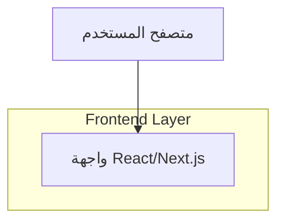

## 1.Architecture design

## 2.Technology Description
- Frontend: React@18 + Next.js (App Router) + TypeScript + TailwindCSS
- Backend: None (لا تغييرات مطلوبة لهذه المهمة)

## 3.Route definitions
| Route | Purpose |
|-------|---------|
| (كما هو حالياً) شاشة ملف التنفيذ/محضر المتابعة | إعادة ترتيب تبويبات محضر المتابعة ونقل الأزرار وإصلاح تفعيل الطلب المعتمد ضمن نفس المسار/الشاشة الحالية بدون إضافة مسارات جديدة |

## 4.API definitions (If it includes backend services)
لا توجد APIs جديدة ضمن هذا النطاق. التعديلات المطلوبة منطق واجهة/حالة (UI state) وربط تمكين زر “تفعيل الطلب” بحالة “Approved”.

## 6.Data model(if applicable)
لا يوجد تعديل على نموذج بيانات/جداول ضمن هذا النطاق.

### ملاحظات تنفيذية مركزة
- حذف تبويب “الصرف/Disburse” يجب أن يكون من مصدر تعريف التبويبات نفسه (Tab config) لضمان عدم ظهوره في UI وعدم إمكانية التنقل له برابط/اختصار.
- نقل الأزرار: توحيد مصدر الأزرار (single action bar component) لتجنب تكرار المنطق وتضارب حالات التعطيل/التحميل.
- إصلاح “تفعيل الطلب المعتمد”: ربط حالة enable/disable مباشرة بحقل حالة الطلب (status) بعد التطبيع (e.g. APPROVED) مع اختبار حالات: لا يوجد طلب، طلب غير معتمد، طلب معتمد.
- نافذة المتابعة ملء الشاشة: استخدام مكوّن Modal/Drawer واحد بنمط full-screen مع قفل تمرير الخلفية وإتاحة إغلاق عبر Esc.
- تبويبات عمودية RTL: جعل الحاوية `dir="rtl"` مع اعتماد تخطيط عمودي (يمين: قائمة التبويبات، يسار: المحتوى) وحالات focus واضحة لدعم لوحة المفاتيح.
