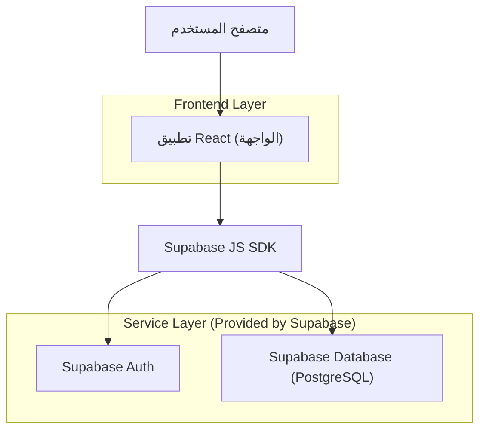
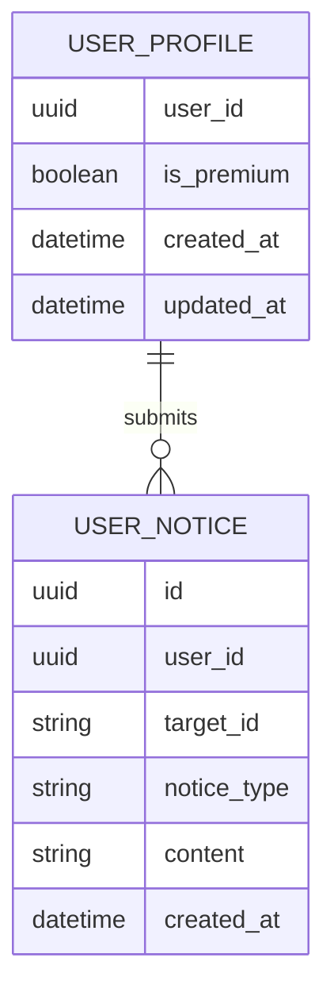

## 1.Architecture design


## 2.Technology Description
- Frontend: React@18 + TypeScript + (نظام الستايل الحالي في المشروع)
- Backend: Supabase (Auth + PostgreSQL + RLS)

## 3.Route definitions
| Route | Purpose |
|-------|---------|
| /details/:targetId | صفحة التفاصيل التي تحتوي زر فتح نافذة «التبليغ/مذكرة الإخبار» |
| /details/:targetId?modal=report | فتح النافذة مباشرة على وضع «تبليغ عادي» (اختياري حسب نظام التوجيه الحالي) |
| /details/:targetId?modal=news | فتح النافذة مباشرة على وضع «مذكرة الإخبار» (اختياري حسب نظام التوجيه الحالي) |

## 6.Data model(if applicable)

### 6.1 Data model definition


### 6.2 Data Definition Language
User Profile (user_profiles)
```
CREATE TABLE user_profiles (
  user_id UUID PRIMARY KEY,
  is_premium BOOLEAN NOT NULL DEFAULT false,
  created_at TIMESTAMPTZ NOT NULL DEFAULT now(),
  updated_at TIMESTAMPTZ NOT NULL DEFAULT now()
);

GRANT SELECT ON user_profiles TO anon;
GRANT ALL PRIVILEGES ON user_profiles TO authenticated;
```

Notices (user_notices)
```
CREATE TABLE user_notices (
  id UUID PRIMARY KEY DEFAULT gen_random_uuid(),
  user_id UUID NOT NULL,
  target_id TEXT NOT NULL,
  notice_type TEXT NOT NULL CHECK (notice_type IN ('report','news_memo')),
  content TEXT NOT NULL,
  created_at TIMESTAMPTZ NOT NULL DEFAULT now()
);

CREATE INDEX idx_user_notices_user_target_type_created_at
  ON user_notices (user_id, target_id, notice_type, created_at DESC);

GRANT SELECT ON user_notices TO anon;
GRANT ALL PRIVILEGES ON user_notices TO authenticated;
```

RLS (سياسات أساسية: ملكية + Premium + قاعدة 7 أيام)
```
ALTER TABLE user_notices ENABLE ROW LEVEL SECURITY;

-- قراءة المستخدم لسجلاته فقط (لدعم إظهار "متبقي X أيام" إن لزم)
CREATE POLICY "read_own_notices"
ON user_notices
FOR SELECT
TO authenticated
USING (user_id = auth.uid());

-- إدراج: 1) ملكية، 2) Premium لمذكرة الإخبار، 3) منع تكرار 7 أيام لكل نوع + هدف
CREATE POLICY "insert_notice_with_guards"
ON user_notices
FOR INSERT
TO authenticated
WITH CHECK (
  user_id = auth.uid()
  AND (
    notice_type <> 'news_memo'
    OR EXISTS (
      SELECT 1 FROM user_profiles p
      WHERE p.user_id = auth.uid() AND p.is_premium = true
    )
  )
  AND NOT EXISTS (
    SELECT 1 FROM user_notices un
    WHERE un.user_id = auth.uid()
      AND un.target_id = user_notices.target_id
      AND un.notice_type = user_notices.notice_type
      AND un.created_at > (now() - interval '7 days')
  )
);
```

ملاحظات تنفيذية
- فصل state يكون في الواجهة: نموذجين مستقلين (report/news_memo) بذاكرة أخطاء وإرسال ونتيجة منفصلة.
- التحقق النهائي لقواعد Premium و7 أيام يجب أن يكون من قاعدة البيانات (RLS) وليس اعتماداً على الواجهة فقط.
- يُفضّل أن تُرجع الواجهة رسائل خطأ واضحة عند رفض الإدراج (cooldown / ليس Premium) عبر تفسير كود الخطأ/الرسالة القادمة من Supabase.