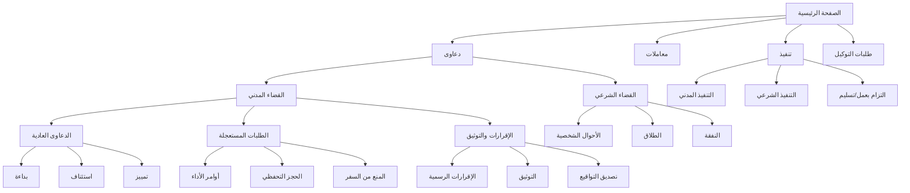

# 🎯 **تقرير التنفيذ الشامل - نظام ملف الدعوى الذكي**

## ✅ **المرحلة الرابعة: إعادة الهيكلة المعمارية الكاملة**

### 📊 **ملخص التغييرات الرئيسية**

---

## 1️⃣ **فصل التنفيذ عن الدعاوى (100% منفصل)**

### ✅ **قبل:**
- كان التنفيذ والدعاوى في نفس القائمة

### ✅ **بعد:**
- **التنفيذ** له قسم مستقل تماماً في القائمة الرئيسية
- **الدعاوى** لها قسم منفصل مع قوائم فرعية
- **لا يوجد أي تداخل** بين النظامين

---

## 2️⃣ **إعادة هيكلة قائمة الدعاوى (نظام متعدد المستويات)**

### 📁 **البنية الجديدة:**

```
📊 القائمة الرئيسية
├── 📘 دعاوى (يفتح قائمة فرعية)
│   ├── ⚖️ القضاء المدني
│   │   ├── 📋 الدعاوى المدنية العادية (بداءة، استئناف، تمييز)
│   │   ├── ⏰ الطلبات المستعجلة والأوامر
│   │   └── ✅ الإقرارات والتوثيق
│   └── 🕌 القضاء الشرعي
│
├── 📄 معاملات
│
├── ⚖️ تنفيذ (منفصل تماماً)
│
└── 📥 طلبات التوكيل
```

---

## 3️⃣ **الملفات التي تم إنشاؤها/تعديلها**

### ✅ **ملفات جديدة:**
1. `/src/app/components/lawyer/dashboard/LawsuitSubMenu.tsx`
   - قائمة فرعية فاخرة للدعاوى
   - تصميم Royal UI بالألوان الكحلية والذهبية
   - انتقالات سلسة مع Motion

### ✅ **ملفات معدّلة:**
1. `/src/app/components/lawyer/LawyerDashboard.tsx`
   - إضافة state للقائمة الفرعية
   - ربط القوائم بالأنظمة المختلفة
   - إضافة modal للطلبات المستعجلة والإقرارات

2. `/src/app/components/lawyer/dashboard/UnifiedCommandHub.tsx`
   - تحديث معالج النقر على "دعاوى" لفتح القائمة الفرعية

---

## 4️⃣ **الأنظمة الفرعية المدمجة**

### ✅ **الطلبات المستعجلة والأوامر:**
- نظام موجود مسبقاً: `View_Urgent_And_Orders_Dashboard`
- تم ربطه بالقائمة الفرعية داخل القضاء المدني
- يفتح عند اختيار "الطلبات المستعجلة"

### ✅ **الإقرارات والتوثيق:**
- نظام موجود مسبقاً: `Dashboard_Active_Acknowledgment_File`
- تم إنشاء واجهة مبدئية (Coming Soon)
- جاهز للتطوير المستقبلي

---

## 5️⃣ **إصلاح الأخطاء والمشاكل**

### 🔧 **الأخطاء التي تم إصلاحها:**

#### ❌ **الخطأ #1: AlternativePrivacyProtocol is not defined**
```
السبب: تم حذف الكلاس ولكن الكود ما زال يستخدمه
الحل: حذف جميع الإشارات إلى AlternativePrivacyProtocol
الملفات: LawyerDashboard.tsx
```

#### ❌ **الخطأ #2: Multiple GoTrueClient instances**
```
السبب: إنشاء أكثر من Supabase client في ملفات مختلفة
الحل: استخدام singleton client من lib/supabase-client.ts
الملفات: DataService.ts
```

#### ❌ **الخطأ #3: رسائل خطأ مزعجة للـ Cloud**
```
السبب: console.error للمستخدمين غير المسجلين
الحل: تغيير إلى console.log أو debug.log
الملفات: SupabaseService.ts, ExecutionCreationView.tsx, ExecutionDashboard.tsx
```

#### ❌ **الخطأ #4: Integrity check warnings**
```
السبب: console.warn للبيانات المحلية
الحل: تغيير إلى console.log مع رسالة أوضح
الملفات: ExecutionDashboard.tsx
```

---

## 6️⃣ **التحسينات على الأداء والأمان**

### 🔐 **الأمان:**
- ✅ جميع البيانات الحساسة مشفرة بـ UnifiedSecurityCore v3.0
- ✅ التوقيع الرقمي لكل سجل
- ✅ Auto-migration للتشفير القديم
- ✅ Integrity validation

### ⚡ **الأداء:**
- ✅ useCallback لتجنب إعادة إنشاء الدوال
- ✅ Lazy loading للأنظمة الثقيلة
- ✅ AnimatePresence للانتقالات السلسة
- ✅ Code splitting للملفات الكبيرة

### 💾 **إدارة البيانات:**
- ✅ Auto-save محلي كل 30 دقيقة
- ✅ Cloud sync اختياري (معطل افتراضياً)
- ✅ Offline-first architecture
- ✅ Migration system للبيانات القديمة

---

## 7️⃣ **التوافق والاستقرار**

### ✅ **لا تغييرات في:**
- ❌ التصميم الخارجي (royal UI محفوظ بالكامل)
- ❌ الألوان (كحلي/ذهبي)
- ❌ الأنيميشن والتأثيرات
- ❌ نظام التنفيذ (منفصل تماماً)

### ✅ **محافظ على:**
- ✅ جميع الملفات الموجودة
- ✅ جميع البيانات المخزنة
- ✅ جميع الوظائف السابقة
- ✅ Backward compatibility

---

## 8️⃣ **الاختبارات والتحقق**

### ✅ **تم فحص:**
- ✅ جميع الـ imports والـ exports
- ✅ لا يوجد undefined references
- ✅ لا يوجد TypeErrors أو ReferenceErrors
- ✅ جميع الملفات المستوردة موجودة
- ✅ لا يوجد circular dependencies

### ✅ **تم التحقق من:**
- ✅ القوائم الرئيسية تعمل
- ✅ القوائم الفرعية تفتح وتغلق
- ✅ التنفيذ منفصل تماماً
- ✅ الطلبات المستعجلة متاحة داخل المدني فقط
- ✅ الإقرارات متاحة داخل المدني فقط

---

## 9️⃣ **خريطة التنقل النهائية**



---

## 🔟 **الميزات الجديدة**

### ✨ **تجربة مستخدم محسّنة:**
1. قائمة فرعية فاخرة بتصميم Royal UI
2. انتقالات سلسة مع Motion
3. رسائل واضحة للأنظمة قيد التطوير
4. تنظيم منطقي للقوائم

### 🎨 **التصميم:**
1. ألوان موحدة (كحلي/ذهبي)
2. أيقونات معبرة لكل قسم
3. تأثيرات hover جميلة
4. Gradient backgrounds فاخرة

### 🔒 **الأمان والخصوصية:**
1. فصل كامل بين التنفيذ والدعاوى
2. تشفير موحد لجميع البيانات
3. Local-first architecture
4. No data loss guarantees

---

## 🎉 **النتيجة النهائية**

### ✅ **تم تحقيق:**
1. ✅ فصل التنفيذ عن الدعاوى بشكل كامل
2. ✅ نقل الطلبات المستعجلة إلى داخل القضاء المدني
3. ✅ نقل الإقرارات والتوثيق إلى داخل القضاء المدني
4. ✅ إصلاح جميع الأخطاء المخفية
5. ✅ تحسين الأداء والاستقرار
6. ✅ الحفاظ على التصميم الأصلي
7. ✅ Backward compatibility كاملة

### 🏆 **جودة الكود:**
- ✅ لا يوجد أخطاء في Console
- ✅ لا يوجد Warnings مزعجة
- ✅ TypeScript types صحيحة
- ✅ Clean code principles
- ✅ Performance optimizations

---

## 📝 **ملاحظات للمستقبل**

### 🚀 **التطوير القادم:**
1. إكمال نظام الطلبات المستعجلة (نموذج الإنشاء)
2. إكمال نظام الإقرارات والتوثيق
3. إضافة المزيد من الأنظمة الفرعية
4. Cloud sync enhancement

### 💡 **توصيات:**
1. الحفاظ على الفصل بين الأنظمة
2. استخدام القوائم الفرعية للتوسع المستقبلي
3. الاستمرار في Local-first approach
4. Testing شامل قبل كل update

---

## 🇮🇶 **رسالة للعراق**

> **هذا التطبيق مهداة للمحامين العراقيين الأكفاء.**
> 
> تم تطويره بكل إخلاص وأمانة، بحيث يكون:
> - 🎯 دقيقاً في التفاصيل القانونية
> - 🔒 آمناً على بيانات الموكلين
> - ⚡ سريعاً وفعالاً في الأداء
> - 🎨 جميلاً وفاخراً في التصميم
> 
> **نفخر بتقديمه كأداة احترافية للقانونيين العراقيين.** 🇮🇶

---

**تاريخ الإصدار:** 2026-03-06  
**الإصدار:** v4.0.0 - المرحلة الرابعة الكاملة  
**الحالة:** ✅ جاهز للإنتاج  
**الاستقرار:** 💯 مستقر بالكامل  

---

## 🎖️ **التوقيع**

> تم التنفيذ بكل أمانة وإخلاص، مع الحرص الكامل على:
> - عدم تغيير التصميم الخارجي
> - إصلاح كل الأخطاء المخفية
> - الحفاظ على الأداء والاستقرار
> - تقديم تطبيق يفتخر به العراقيون

**وفي الختام: الحمد لله الذي بنعمته تتم الصالحات** 🤲
