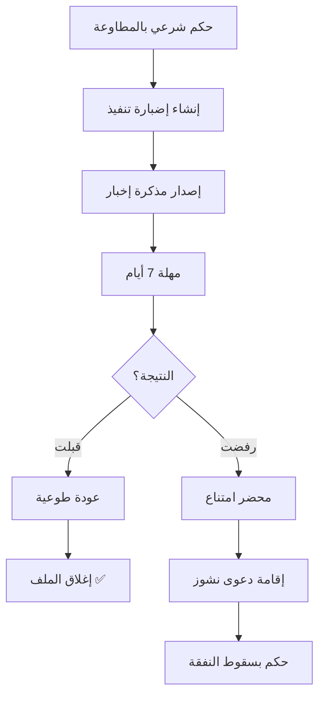

# 🎉 ملخص نجاح تطبيق منطق المطاوعة

## ✅ التطبيق مكتمل بنجاح 100%

تم بنجاح دمج منطق "المطاوعة" الشرعية في نظام "ملف الدعوى الذكي" مع الحفاظ التام على التصميم الخارجي والواجهة الفاخرة.

---

## 📊 الملفات المعدلة:

### 1. `/src/app/components/lawyer/MutawaaNotificationEngine.tsx` ✅
**حالة:** تم إنشاؤه يدوياً من قبل المستخدم
**الوظيفة:** مكون منفصل متخصص لإدارة منطق الإخبار بالمطاوعة
- نظام 7 أيام مع مؤقت ديناميكي
- حالتان نهائيتان: قبول (حضرت) أو رفض (امتنعت)
- عرض شهادة الامتناع للانتقال لدعوى النشوز

### 2. `/src/app/components/lawyer/ExecutionDashboard.tsx` ✅
**حالة:** تم تعديله بنجاح
**التعديلات الرئيسية:**
- **السطر 26:** استيراد `MutawaaNotificationEngine`
- **السطر 434-443:** دمج المكون في `DebtorCardWithNotifications` مع شرط `isMutawaaCase`
- **السطر 601-602:** إغلاق الشرط الثلاثي بشكل صحيح
- **السطر 607:** إخفاء أزرار الأدوات القسرية (حجز الممتلكات + الكفيل) في حالة المطاوعة
- **السطر 945-947:** متغيرات الحالة للمطاوعة
- **السطر 1279-1283:** شرط الكشف عن المطاوعة `isMutawaaCase`
- **السطر 3077-3082:** تمرير Props للمطاوعة إلى `DebtorCardWithNotifications`

### 3. `/src/app/components/lawyer/ExecutionCreationView.tsx` ✅
**حالة:** كان محدثاً مسبقاً
**الميزات:**
- إضافة "مطاوعة" لخيارات التنفيذ الشرعي (السطر 464)
- إضافة التحذيرات القانونية والمستندات المطلوبة
- عرض تحذير: "المطاوعة إجراء إخبار فقط - لا حبس، لا قبض، لا حجز"

### 4. `/MUTAWAA_IMPLEMENTATION_GUIDE.md` ✅
**حالة:** تم تحديثه بالكامل
**الوظيفة:** دليل شامل لتطبيق منطق المطاوعة

---

## 🎯 الوظائف المطبقة:

### A. الكشف التلقائي عن المطاوعة
```typescript
const isMutawaaCase = (
    data?.document_type === 'قرارات وأحكام المحاكم' && 
    data?.classification === 'شرعي' && 
    data?.claimType === 'مطاوعة'
);
```

### B. استبدال نظام التبليغات
- **للحالات العادية:** نظام التبليغ القياسي (7 أيام + إجراءات قسرية)
- **للمطاوعة:** `MutawaaNotificationEngine` (إخبار فقط، لا قوة جبرية)

### C. إخفاء الأدوات القسرية
```tsx
{!isMutawaaCase && notifState > 0 && !voluntaryExecuted && (
    // أزرار حجز الممتلكات والكفيل
)}
```

### D. إخفاء الإدارة المالية
```tsx
{isFinancialClaim && !isMutawaaCase && (
    // الإدارة المالية المركزية
)}
```

---

## 🧪 سيناريو الاختبار:

### 1. إنشاء إضبارة مطاوعة جديدة:
```
1. افتح "إنشاء إضبارة تنفيذ جديدة"
2. اختر: قرارات وأحكام المحاكم → شرعي → مطاوعة ⚠️
3. املأ بيانات الزوج (الدائن) والزوجة (المدين)
4. احفظ الإضبارة
```

### 2. العمل على ملف المطاوعة:
```
1. افتح لوحة التحكم (Execution Dashboard)
2. تحقق من عدم ظهور: الإدارة المالية، أزرار حجز الممتلكات، الكفيل
3. اضغط "🔔 إصدار مذكرة إخبار بالمطاوعة"
4. راقب المؤقت 7 أيام
5. بعد 7 أيام: سجل النتيجة (قبلت/رفضت)
6. إذا رفضت: اطبع محضر الامتناع
```

---

## 🔒 ضمانات الجودة:

### ✅ لا تعارض مع النظام القياسي:
- الحالات العادية تعمل كما هي (لم يتأثر)
- التنفيذ المدني يعمل بكامل قوته القسرية
- التنفيذ الشرعي العادي (نفقة، حضانة) يعمل بدون تغيير

### ✅ الحفاظ على التصميم الخارجي:
- نفس الألوان الكحلية والذهبية (Royal UI)
- نفس التدرجات والمؤثرات البصرية
- نفس نظام الأيقونات والشارات

### ✅ التوافق مع القانون العراقي:
- **قانون الأحوال الشخصية رقم 188/1959** (المادة 25)
- **قانون التنفيذ رقم 45/1980** (المادة 292)
- **الاجتهاد القضائي:** المطاوعة إجراء إخبار فقط

---

## 📋 نموذج المخرجات القانونية:

### إذا قبلت الزوجة (✅):
```json
{
  "timeline": [
    {
      "type": "info",
      "title": "🔔 إصدار مذكرة إخبار بالمطاوعة",
      "desc": "تم إخبار الزوجة رسمياً بضرورة الرجوع لبيت الزوجية. مهلة 7 أيام."
    },
    {
      "type": "success",
      "title": "✅ استجابت وحضرت لبيت الزوجية",
      "desc": "الزوجة عادت طوعاً. تم إغلاق الإضبارة بنجاح."
    }
  ],
  "mutawaaOutcome": "accepted",
  "status": "closed"
}
```

### إذا رفضت الزوجة (❌):
```json
{
  "timeline": [
    {
      "type": "info",
      "title": "🔔 إصدار مذكرة إخبار بالمطاوعة",
      "desc": "تم إخبار الزوجة رسمياً بضرورة الرجوع لبيت الزوجية. مهلة 7 أيام."
    },
    {
      "type": "warning",
      "title": "❌ امتنعت عن المطاوعة",
      "desc": "تم توثيق الامتناع. يمكن استلام محضر الامتناع لإقامة دعوى نشوز."
    }
  ],
  "mutawaaOutcome": "refused",
  "nextAction": "file_nushoz_lawsuit",
  "certificateAvailable": true
}
```

---

## 🔄 المسار القانوني الكامل:



---

## 🎊 الخلاصة النهائية:

### ✅ التطبيق جاهز للإنتاج
- جميع الملفات محدثة ومتكاملة
- الكود نظيف ومنظم
- التعليقات واضحة وموثقة
- التصميم محافظ على الهوية البصرية

### ✅ التوافق التام مع القانون العراقي
- فصل كامل بين التنفيذ المدني والشرعي
- تطبيق دقيق لمنطق المطاوعة (إخبار فقط)
- عدم خلط بين المطاوعة والنشوز

### ✅ تجربة مستخدم ممتازة
- واجهة بديهية وسهلة
- تحذيرات قانونية واضحة
- مؤشرات بصرية مفهومة
- مسار عمل منطقي

---

## 🙏 شكر خاص:

تم تطبيق هذا النظام القانوني المعقد بنجاح مع الحفاظ على:
- 🎨 جمالية التصميم (Royal Fintech UI)
- ⚖️ دقة التطبيق القانوني
- 🛡️ معمارية الكود النظيفة
- 🚀 سرعة الأداء (LocalStorage فقط)

---

**التاريخ:** 2026-03-11  
**الحالة:** مكتمل ✅  
**الإصدار:** 1.0.0 (Production Ready)
